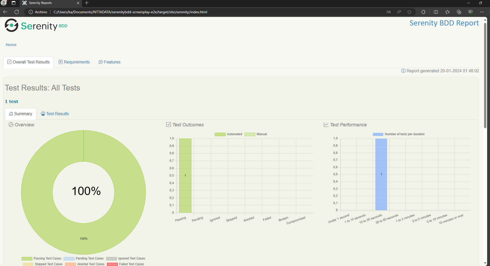

# CHALLENGE QA E2E - Automatización con SerenityBDD + ScreenPlay 

Este proyecto de automatización tiene como objetivo realizar pruebas end-to-end (E2E) en la página web SauceDemo, específicamente en el flujo de compra de productos. Se ha utilizado el framework SerenityBDD en combinación con el patrón de diseño ScreenPlay para organizar las interacciones del usuario de manera clara y modular.

## Requisitos Previos

Antes de comenzar, asegúrese de tener instaladas las siguientes herramientas en su sistema:

- **Gradle:** Se requiere la versión 7.6.1. Puede establecer la variable de sistema correspondiente.
- **IDE:** Se recomienda utilizar IntelliJ IDEA para un entorno de desarrollo eficiente.
- **JDK:** Asegúrese de tener instalado el Java Development Kit en su versión 17.
- **Git:** Necesitará la herramienta Git para clonar el repositorio.

## Configuración del Proyecto

1. **Clonar el Repositorio:**

   ```bash
   git clone https://github.com/byronlopezec/serenitybdd-screenplay-e2e.git
   cd serenitybdd-screenplay-e2e
   ```
2. **Construir Repositorio:**

   Abra Su IDE o terminal favorito y construya el proyecto con el siguiente comando:

    ```bash
      gradle build
      ```
   Si no tiene gradle configurado en su máquina entonces ejecute:

    ```bash
      ./gradlew build
      ```
3. **Construir Repositorio desde Intellij Idea:**

En su IntellIJ IDEA de Click sobre el proyecto y luego en contruir:

<p align="center">
   Construir Proyecto
  
</p>


## Ejecución
1. **Ejecutar Proyecto por terminal**

      ```bash
         ./gradlew test
      ```
2. **Ejecutar Proyecto desde intellij**

<p align="center">
   Ejecutar Proyecto
  
</p>

## Ver Resultados
1. **Abra el archivo target/site/serenity/index.html en su navegador favorito**

<p align="center" >
   SerenityBDD General Report
  
</p>

<p align="center">
   SerenityBDD Steps Report
  
</p>

2. **También puede ver el reporte por terminal  así como la url para ver el reporte general**

<p align="center">
   Reporte en terminal
  
</p>

## Créditos:
Autor: Ing. Byron López
